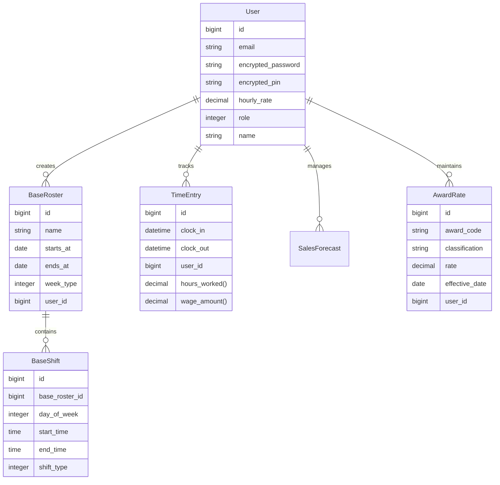

# Database schema

**Source of truth**: `db/schema.rb` (generated from migrations)  
**Last reviewed**: 2025-12-23  
**Database**: PostgreSQL  
**Primary key type**: bigint (Rails 8.1 default)

## Purpose
- Provide a human-readable overview of the data model for a roster and time-tracking application
- Document business logic, constraints, and relationships for employee scheduling and wage management
- Make it easy to understand the core entities: Users, Rosters, Shifts, Time Entries, and Award Rates
- Support planning for features like sales forecasting and Fair Work award compliance

## How to update (process)
1. Make the schema change via migration: `rails generate migration AddFieldToTable field:type`
2. Run migrations locally: `bundle exec rails db:migrate`
3. Ensure `db/schema.rb` is updated automatically
4. Update this document (only the tables impacted)
5. Add notes for any data migrations, backfills, or rollouts

## High-level model map
The application manages employee scheduling, time tracking, and wage calculations for businesses:

- **User Management**: Authentication, roles, and PIN-based clock-in/out
- **Roster Management**: Template-based scheduling with shift assignments
- **Time Tracking**: Clock in/out with automatic wage calculations
- **Award Compliance**: Integration with Fair Work API for award rates
- **Sales Forecasting**: Business intelligence for staffing decisions

Data flows from Users → Base Rosters → Base Shifts for scheduling, and Users → Time Entries for actual hours worked.

## Mermaid diagram

---

## Tables

### `users`
**Purpose**: Core user accounts with authentication, authorization, and employee profile data.

#### Columns
| Column | Type | Null | Default | Notes |
|---|---|---|---|---|
| id | bigint | NO |  | Primary key |
| email | string | NO | "" | Unique, Devise-authenticated |
| encrypted_password | string | NO | "" | Devise password hash |
| encrypted_pin | string | YES |  | AES-256 encrypted clock-in PIN |
| encrypted_pin_iv | string | YES |  | Initialization vector for PIN encryption |
| hourly_rate | decimal(8,2) | YES | "0.0" | Base hourly wage rate |
| name | string | YES |  | Display name |
| remember_created_at | datetime | YES |  | Devise remember token |
| reset_password_sent_at | datetime | YES |  | Devise password reset |
| reset_password_token | string | YES |  | Devise reset token (unique) |
| role | integer | NO | 2 | Enum: admin=0, manager=1, staff=2 |
| created_at | datetime | NO |  |  |
| updated_at | datetime | NO |  |  |

#### Indexes
| Name | Columns | Unique | Notes |
|---|---|---|---|
| index_users_on_email | email | YES | Case-sensitive uniqueness |
| index_users_on_reset_password_token | reset_password_token | YES | Devise requirement |

#### Foreign keys
- (none - root entity)

#### Relationships (Rails)
- `has_many :time_entries, dependent: :destroy`
- `has_many :sales_forecasts, dependent: :destroy`
- `has_many :award_rates, dependent: :destroy`
- `has_many :base_rosters, dependent: :destroy`

#### Validations / invariants (Rails)
- `email` must be present, unique (Devise handles format validation)
- `hourly_rate` must be >= 0 if present
- `role` enum with default :staff
- PIN encryption uses AES-256 with Rails secret_key_base

#### Data lifecycle
- Soft delete not implemented (would need `deleted_at`)
- PIN data is encrypted at rest
- Password reset tokens expire automatically (Devise)

#### Notes
- Uses Devise for authentication with database_authenticatable, registerable, recoverable, rememberable, validatable
- PIN-based authentication for clock-in/out functionality (encrypted with AES-256)
- Role-based authorisation with enum (admin > manager > staff)
- Hourly rate used for wage calculations in time entries

---

### `base_rosters`
**Purpose**: Roster templates defining scheduling periods and week patterns for users.

#### Columns
| Column | Type | Null | Default | Notes |
|---|---|---|---|---|
| id | bigint | NO |  | Primary key |
| name | string | NO |  | Roster display name |
| starts_at | date | NO |  | Roster period start |
| ends_at | date | NO |  | Roster period end |
| week_type | integer | NO | 0 | Enum: weekly=0, fortnightly=1 |
| user_id | bigint | NO |  | FK → users |
| created_at | datetime | NO |  |  |
| updated_at | datetime | NO |  |  |

#### Indexes
| Name | Columns | Unique | Notes |
|---|---|---|---|
| index_base_rosters_on_user_id | user_id | NO | Foreign key index |

#### Foreign keys
- `base_rosters.user_id → users.id`

#### Relationships (Rails)
- `belongs_to :user`
- `has_many :base_shifts, dependent: :destroy`

#### Validations / invariants (Rails)
- `name`, `starts_at`, `ends_at`, `week_type` must be present
- `ends_at` must be after `starts_at` (custom validation)
- `week_type` enum with default :weekly

#### Data lifecycle
- Cascade delete through dependent: :destroy on base_shifts
- No archiving (would need `archived_at`)

#### Notes
- Represents scheduling templates, not actual worked shifts
- Week type affects how roster periods repeat
- Used as container for base_shifts that define actual schedule

---

### `base_shifts`
**Purpose**: Individual shift definitions within roster templates, specifying days, times, and shift types.

#### Columns
| Column | Type | Null | Default | Notes |
|---|---|---|---|---|
| id | bigint | NO |  | Primary key |
| base_roster_id | bigint | NO |  | FK → base_rosters |
| day_of_week | integer | NO |  | Enum: sun=0, mon=1, tue=2, wed=3, thu=4, fri=5, sat=6 |
| start_time | time | NO |  | Shift start time |
| end_time | time | NO |  | Shift end time |
| shift_type | integer | NO |  | Enum: morning=0, afternoon=1, evening=2, night=3 |
| created_at | datetime | NO |  |  |
| updated_at | datetime | NO |  |  |

#### Indexes
| Name | Columns | Unique | Notes |
|---|---|---|---|
| index_base_shifts_on_base_roster_id | base_roster_id | NO | Foreign key index |

#### Foreign keys
- `base_shifts.base_roster_id → base_rosters.id`

#### Relationships (Rails)
- `belongs_to :base_roster`

#### Validations / invariants (Rails)
- `day_of_week`, `shift_type`, `start_time`, `end_time` must be present
- `end_time` must be after `start_time` (custom validation)
- No overlapping shifts on same day within same roster (custom validation)

#### Data lifecycle
- Cascade delete through base_roster dependent: :destroy
- No individual archiving

#### Notes
- Defines scheduled shift patterns, not actual worked time
- Overlap prevention ensures valid roster templates
- Day and shift type enums support business logic for scheduling rules

---

### `time_entries`
**Purpose**: Records of actual clock-in and clock-out times for time tracking and wage calculation.

#### Columns
| Column | Type | Null | Default | Notes |
|---|---|---|---|---|
| id | bigint | NO |  | Primary key |
| clock_in | datetime | YES |  | Clock-in timestamp |
| clock_out | datetime | YES |  | Clock-out timestamp |
| user_id | bigint | NO |  | FK → users |
| created_at | datetime | NO |  |  |
| updated_at | datetime | NO |  |  |

#### Indexes
| Name | Columns | Unique | Notes |
|---|---|---|---|
| index_time_entries_on_user_id | user_id | NO | Foreign key index |

#### Foreign keys
- `time_entries.user_id → users.id`

#### Relationships (Rails)
- `belongs_to :user`

#### Validations / invariants (Rails)
- `clock_in` must be present (clock_out optional for ongoing shifts)
- `clock_out` must be after `clock_in` if present (custom validation)

#### Data lifecycle
- No soft delete (time entries are audit trail)
- Retention policy not specified *This will need to be updated to meet legislation*

#### Notes
- Supports both completed shifts (clock_in + clock_out) and ongoing shifts (clock_in only)
- Business methods: `duration`, `hours_worked`, `wage_amount` (calculated from user.hourly_rate)
- `completed` scope for finished entries, `ongoing?` method for active shifts

---

### `sales_forecasts`
**Purpose**: Sales projections with confidence levels to support staffing and business planning decisions.

#### Columns
| Column | Type | Null | Default | Notes |
|---|---|---|---|---|
| id | bigint | NO |  | Primary key |
| actual_sales | decimal(8,2) | YES |  | Actual sales achieved |
| confidence_level | integer | YES |  | Forecast confidence (0-100%) |
| end_date | date | YES |  | Forecast period end |
| forecast_type | integer | YES |  | Enum: weekly=0, fortnightly=1, monthly=2 |
| projected_sales | decimal(8,2) | YES |  | Projected sales amount |
| start_date | date | YES |  | Forecast period start |
| user_id | bigint | NO |  | FK → users |
| created_at | datetime | NO |  |  |
| updated_at | datetime | NO |  |  |

#### Indexes
| Name | Columns | Unique | Notes |
|---|---|---|---|
| index_sales_forecasts_on_user_id | user_id | NO | Foreign key index |

#### Foreign keys
- `sales_forecasts.user_id → users.id`

#### Relationships (Rails)
- `belongs_to :user`

#### Validations / invariants (Rails)
- `forecast_type` must be present
- `start_date`, `end_date` must be present
- `projected_sales`, `actual_sales` must be >= 0 if present
- `confidence_level` must be 0-100 if present
- `end_date` must be after `start_date` (custom validation)

#### Data lifecycle
- No archiving specified
- Historical forecasting data retained

#### Notes
- Supports tracking both projections and actual results
- Confidence levels help assess forecast reliability
- User association allows per-user forecasting (e.g., store managers)

---

### `award_rates`
**Purpose**: Fair Work award rates for compliance with Australian workplace laws and proper wage calculations.

#### Columns
| Column | Type | Null | Default | Notes |
|---|---|---|---|---|
| id | bigint | NO |  | Primary key |
| award_code | string | NO |  | Fair Work award identifier |
| classification | string | NO |  | Job classification level |
| effective_date | date | NO |  | When rate becomes effective |
| rate | decimal | NO |  | Hourly award rate |
| user_id | bigint | NO |  | FK → users |
| created_at | datetime | NO |  |  |
| updated_at | datetime | NO |  |  |

#### Indexes
| Name | Columns | Unique | Notes |
|---|---|---|---|
| index_award_rates_on_user_id | user_id | NO | Foreign key index |

#### Foreign keys
- `award_rates.user_id → users.id`

#### Relationships (Rails)
- `belongs_to :user`

#### Validations / invariants (Rails)
- `award_code`, `classification`, `rate`, `effective_date` must be present
- `rate` must be > 0
- `user` must be present

#### Data lifecycle
- No soft delete (audit trail for compliance)
- Historical rates retained for back-dated calculations

#### Notes
- Integrates with Fair Work API for automatic rate updates
- `active` scope for current rates, `by_award_code` for filtering
- `fetch_and_update_rates_for_user` class method for API integration
- Effective date determines which rate applies for time period

---

## Cross-cutting concerns checklist
- ✅ Index all foreign keys (all FKs have indexes)
- ✅ Add unique indexes for business identifiers (email, reset_password_token)
- ✅ Avoid polymorphic associations (none used - explicit FKs preferred)
- ✅ Use database constraints for invariants (NOT NULL, CHECK via validations)
- ✅ Consider counter caches (not needed - no frequent counting queries)
- ✅ Use appropriate data types (decimal for money, date/time for temporal)
- ✅ Encrypt sensitive data (PIN encryption with AES-256)
- ✅ Validate data at model level (comprehensive validations)
- ✅ Use enums for controlled vocabularies (role, week_type, day_of_week, etc.)
- ✅ Implement business logic in models (duration, wage calculations)
- ✅ Use scopes for common queries (active, completed, etc.)